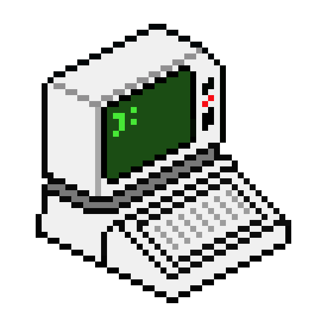

## Начало работы
Создать форк [репозитория](https://github.com/PoteeDev/piece-of-code.git)

или
```bash
git clone https://github.com/PoteeDev/piece-of-code.git
cd piece-of-code 
git checkout -b my-aricle
```

Структура для добавления поста
```bash
content
└── ru
    └── posts
        └── how-to-write-posts.md
```

Для того чтобы добавить изображения к статье необходимо использовать следующую структуру
```bash
content
└── ru
    └── posts
        └──how-to-write-posts
            ├── images
            │   └── computer.png
            └── index.md
```
в таком случае название должно быть **index.md**

### Метадата для файла
#### Пример 
```yaml
---
title: How to write posts
date: 2022-07-29 09:00:00
author: ivanh
github: https://github.com/Ivanhahanov
tg: http://t.me/ivanh3
tags:
    - hugo
categories:
    - tutorial
keywords:
    - markdown
    - hugo
    - tutorial
---

Текст статьи здесь...
```
#### Описание полей
- title - Название статьи
- date - Дата публикации
- author - Никнейм автора
- github - Ссылка на github автора (не обязательное поле)
- tg - Ссылка на телеграм автора (не обязательное поле)
- tags - Теги для поиска
- categories - Список категорий
- keywords - Список ключевых слов для поисковых роботов

## Загрузка статьи
### Предпросмотр
[Установка hugo](https://gohugo.io/getting-started/installing/)
```
hugo server
```
### Сохранение изменений
```
git add <файлы>
git commit -m "<описание изменений>"
```

Запушить и создать [pull request](https://docs.github.com/en/pull-requests/collaborating-with-pull-requests/proposing-changes-to-your-work-with-pull-requests/creating-a-pull-request-from-a-fork) к основному репозиторию


## Использование медиа контента
### Маленькое изображение
```html

```

### Маленькое изображение с подписью
```html

```


### Полноразмерное изображение
```html

```


### Добавление Youtube видео
```html

```
